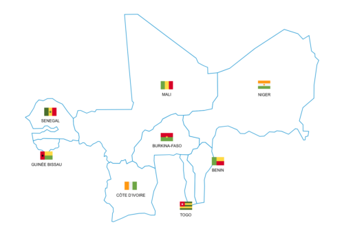

```{r}

#| label: reinitialisation et repertoire
#| include: false
#| 
rm(list=ls()) #Remove all objects created
setwd("D:/tgtanoh/Visibilite/DASH_DG")
.libPaths("D:/tgtanoh/R/win-library/4.5")
```

```{r}
#install.packages("bslib")
#install.packages("bsicons")
#install.packages("shinydashboard")
#install.packages("DT")
#install.packages("leaflet")
#install.packages("reactable")
#install.packages("magick")
#install.packages("magickGUI")
```

```{r}
#| label: chargement package

#install.packages("bslib")
#?value_box si tu veux des codes et modèles
library(ggplot2)
library(tidyverse)
library(plotly)#friendly visuel
library(bslib)
library(bsicons)
library(shiny)
library(reactable)
library(shiny)
library(dplyr)
library(sf)
library(leaflet)
library(stringr)
library(lubridate)
library(tidyr)
library(zoo)
library(htmltools)
library(magickGUI)
library(magick)
library(stringr)
## Acceuil {orientation="row" scrolling="true"}
#
```


```{r}
#| label: Préparation des données dash acceuil
#| include: false

library(readxl)
library(dplyr)

Dash_ind_a <- read_excel("Acceuil_a.xlsx")
```

```{r}
Annee_dm = Dash_ind_a [,1]
PIB_UE_A = Dash_ind_a [,2]
PIB_UE_prim_A	= Dash_ind_a [,6]
PIB_UE_sec_A = Dash_ind_a [,7]
PIB_UE_Ter_A = Dash_ind_a [,8]
Inflation_UE_A = Dash_ind_a [,9]
Endettement_A	= Dash_ind_a [,10]
Déficit_bud_dons_A = Dash_ind_a [,11]
Solde_courant_dons_A = Dash_ind_a [,12]
```


```{r}
#| label: Préparation des données mensuelle
#| include: false

library(readxl)
library(dplyr)

Dash_ind_m <- read_excel("Acceuil_m.xlsx")
```


```{r}
Mois_dm = Dash_ind_m [,1]
Inflation_UE_m = Dash_ind_m [,2]
Ctr_Infl_Alime_UEm	= Dash_ind_m [,3]
Ctr_Infl_Autr_UEm = Dash_ind_m [,4]
Inflation_SJ_UEm = Dash_ind_m [,5]
cours_Prod_alim_imp_UEm = Dash_ind_m [,6]
cours_dol_FCFA_m	= Dash_ind_m [,7]
cours_petr_dol_m = Dash_ind_m [,8]
cours_Or_dol_once_m = Dash_ind_m [,9]
cours_cacao_cts_liv_m = Dash_ind_m [,10]
cours_cafe_cts_liv_m = Dash_ind_m [,11]
Ess_Pro_temp_UEm = Dash_ind_m [,12]
Gasoil_UEm = Dash_ind_m [,13]
Tx_débiteur_UEm	= Dash_ind_m [,14]
Tx_créditeur_UEm = Dash_ind_m [,15]
Tx_min_soum_m = Dash_ind_m [,16]
Tx_prêt_marg_m = Dash_ind_m [,17]
Tx_moy_inter_sem_m	= Dash_ind_m [,18]
couv_emi_moné_UEm = Dash_ind_m [,19]
Reserves_m	= Dash_ind_m [,20]
Clim_aff_UEm = Dash_ind_m [,21]
IPI_UEm	= Dash_ind_m [,22]
ICA_com_UEm = Dash_ind_m [,23]
ICA_serv_UEm	= Dash_ind_m [,24]

```

```{r}
#| label: Préparation des données tableau mensuelles étape 1
#| include: false

df <- data.frame(
Mois = Dash_ind_m [[1]],
Inflation = Dash_ind_m [[2]],
Aliments_importés = Dash_ind_m [[6]],
Tx_débiteur	= Dash_ind_m [[14]],
Tx_créditeur = Dash_ind_m [[15]],
Tx_min_soumission = Dash_ind_m [[16]],
Tx_prêt_marginal = Dash_ind_m [[17]],
Tx_interbancaire_hebdo	= Dash_ind_m [[18]],
Couverture_monétaire = Dash_ind_m [[19]],
Climat_des_affaires = Dash_ind_m [[21]],
IPI = Dash_ind_m [[22]],
ICA_commerce = Dash_ind_m [[23]],
ICA_service	= Dash_ind_m [[24]]
  )
```

```{r}
#| label: Préparation des données tableau cours mensuelles 
#| include: false

df1 <- data.frame(
Mois = Dash_ind_m [[1]],
Pétrol_dollar = Dash_ind_m [[8]],
Or_dollar_once = Dash_ind_m [[9]],
Cacao_cents = Dash_ind_m [[10]],
Café_cents = Dash_ind_m [[11]]
  )
```


```{r}

#| label: Préparation des données tableau mensuelles étape 2
#| include: false

library(dplyr)
library(tidyr)

# Liste des indicateurs
vars <- c(
  "Inflation", "Aliments_importés",
  "Tx_débiteur", "Tx_créditeur",
  "Tx_min_soumission", "Tx_prêt_marginal",
  "Tx_interbancaire_hebdo", "Couverture_monétaire",
  "IPI", "ICA_commerce", "ICA_service"
)

# Passage en format long
df_long <- df %>%
  select(Mois, all_of(vars)) %>%
  pivot_longer(cols = -Mois,
               names_to = "Indicateur",
               values_to = "Valeur") %>%
  arrange(Indicateur, Mois)
```

```{r}
#| label: Calcul variation données tableau mensuelles 
#| include: false

df_table <- df_long %>%
  group_by(Indicateur) %>%
  arrange(Mois) %>%
  mutate(
    Variation = Valeur - lag(Valeur),
    Signe = case_when(
       Variation > 0 ~ "▲+",
      Variation < 0 ~ "▼-",
      TRUE ~ "🔵 ="
    )
  ) %>%
  ungroup() %>%
  filter(Mois == max(Mois)) %>%
  mutate(
    Valeur = round(Valeur, 4),
    Variation = round(Variation, 4)
  ) %>%
  select(Indicateur, Valeur, Variation, Signe)

```

```{r}
#| label: tableau mensuelles V1 traitement de décimales 
#| include: false

df_table <- df_table %>%
  mutate(
    Valeur_aff = case_when(
      Indicateur %in% c(
        "Tx_débiteur",
        "Tx_créditeur",
        "Tx_min_soumission",
        "Tx_prêt_marginal",
        "Tx_interbancaire_hebdo"
      ) ~ sprintf("%.2f", Valeur),
      TRUE ~ sprintf("%.1f", Valeur)
    ),
    Variation_aff = case_when(
      Indicateur %in% c(
        "Tx_débiteur",
        "Tx_créditeur",
        "Tx_min_soumission",
        "Tx_prêt_marginal",
        "Tx_interbancaire_hebdo"
      ) ~ sprintf("%.2f", Variation),
      TRUE ~ sprintf("%.1f", Variation)
    )
  )


```

```{r}
#| label: affichage tableau mensuelles etape1
#| include: false

df_table_aff <- df_table %>%
  select(
    Indicateur,
    Valeur = Valeur_aff,
    Variation = Variation_aff,
    Signe
  )
```


```{r}

#| label: Préparation des données tableau cours mensuelles etape2
#| include: false

library(dplyr)
library(tidyr)

# Liste des indicateurs
vars1 <- c(
  "Pétrol_dollar",
  "Or_dollar_once", "Cacao_cents", "Café_cents"
)

# Passage en format long
df_long1 <- df1 %>%
  select(Mois, all_of(vars1)) %>%
  pivot_longer(cols = -Mois,
               names_to = "Cours",
               values_to = "Niveau") %>%
  arrange(Cours, Mois)
```

```{r}
#| label: Calcul variation données cours mensuelles etape3
#| include: false

df_table1 <- df_long1 %>%
  group_by(Cours) %>%
  arrange(Mois) %>%
  mutate(
    Evolution = 100 * (Niveau / lag(Niveau) - 1),
    Sens = case_when(
       Evolution > 0 ~ "▲+",
      Evolution < 0 ~ "▼-",
      TRUE ~ "🔵 ="
    )
  ) %>%
  ungroup() %>%
  filter(Mois == max(Mois)) %>%
  mutate(
    Niveau = round( Niveau, 1),
    Evolution = round(Evolution, 1)
  ) %>%
  select(Cours, Niveau, Evolution, Sens)

```


```{r}
#| label: gérer mois et année
#| include: false

library(lubridate)
Encour_mois <- max(Dash_ind_m$Mois)
mois_nom <- month(Encour_mois, label = TRUE, abbr = FALSE)
mois_nom <- as.character(mois_nom)
annee_num <- year(Encour_mois)


```


```{r}
#| label: Alertes inflation
#| include: false


inf_actuelle <- tail(Dash_ind_m$Inflation_UEMOA, 1)[1]#si ca ne passe pas prend le ts "IPD_ts"
inf_precedente <- tail(Dash_ind_m$Inflation_UEMOA, 2)[1] #glissement annuel attention pas mensuel

variation_inf <-  inf_actuelle - inf_precedente


delta_inf = round(variation_inf,1)
  
diagnostic_inf <- case_when(
  delta_inf > 0  ~ "Inflation en hausse de +",
  delta_inf == 0 ~ "Inflation stable ",
  delta_inf < 0 ~ "Inflation en baisse de ",
  TRUE ~ "Risque inflationniste"
)


```

```{r}
#| label: Alertes climat affaire
#| include: false


clim_actuelle <- tail(Dash_ind_m$Climat_des_affaires, 1)[1]#si ca ne passe pas prend le ts "IPD_ts"
clim_precedente <- tail(Dash_ind_m$Climat_des_affaires, 2)[1] #glissement annuel attention pas mensuel

variation_clim <-  clim_actuelle - clim_precedente


delta_clim = round(variation_clim,2)
  
diagnostic_clim <- case_when(
  delta_clim > 0  ~ "Amelioration du climat des affaires de +",
  delta_clim == 0 ~ "Stabilité du climat des affaires ",
  delta_clim < 0 ~ "Dégradation du climat des affaires de",
  TRUE ~ "Risque haussier"
)


```


```{r}
#| label: Alertes cours pétrol
#| include: false


petro_actuelle <- tail(Dash_ind_m$Cours_petrol_dollar, 1)[1]#si ca ne passe pas prend le ts "IPD_ts"
petro_precedente <- tail(Dash_ind_m$Cours_petrol_dollar, 2)[1] #glissement annuel attention pas mensuel

variation_petro   = 100 * (petro_actuelle / petro_precedente - 1)


delta_petro = round(variation_petro,1)
  
diagnostic_petro <- case_when(
  delta_petro > 0  ~ "Cours du pétrole en hausse de +",
  delta_petro == 0 ~ "Stabilité du cours du pétrole ",
  delta_petro < 0 ~ "Cours du pétrole en baisse de ",
  TRUE ~ "Risque haussier"
)


```


```{r}
#| label: Alertes cours aliments importés
#| include: false


impo_actuelle <- tail(Dash_ind_m$Produits_alimentaires_importés, 1)[1]#si ca ne passe pas prend le ts "IPD_ts"
impo_precedente <- tail(Dash_ind_m$Produits_alimentaires_importés, 2)[1] #glissement annuel attention pas mensuel

variation_impo <-  impo_actuelle - impo_precedente


delta_impo = round(variation_impo,1)
  
diagnostic_impo <- case_when(
  delta_impo > 0  ~ "Cours des produits alimentaires importés en hausse de +",
  delta_impo == 0 ~ "Cours des produits alimentaires importés stable ",
  delta_impo < 0 ~ "Cours des produits alimentaires importés en baisse de ",
  TRUE ~ "Risque haussier"
)


```


```{r}
#| label: Préparation des données trimestrielles
#| include: false

library(readxl)
library(dplyr)

Dash_ind_t <- read_excel("Acceuil_t.xlsx")
```


```{r}
Trim_dm <- Dash_ind_t [[1]]
PIB_UEMOA_T <- Dash_ind_t [[2]]
PIB_UE_prim_T	<- Dash_ind_t [[3]]
PIB_UE_sec_T <- Dash_ind_t [[4]]
PIB_UE_Ter_T <- Dash_ind_t [[5]]
Inflation_UEMOA_T <- Dash_ind_t [[6]]
```

```{r}
#| label:  mise en TS
#| include: false


```

```{r}
#| label: Préparation value box DMPI
#| include: false


```


# Vue globale UEMOA 

## on crée colonne1 pour la carte 


```{=html}
<div class="dmpi-network">

  <canvas id="network-canvas"></canvas>

  <div class="logo-box">
    
    <div class="title-container">
      <div class="dmpi-title">
         <span> Où en est l'économie ? </span>
      </div>
    </div>

  </div>

</div>
```


::: {.card title="Points d'alerte au mois de Mai 2026"}

```{r}
library(htmltools)

ponctua <- " pdp."
pourc <- " %."
pointe <- " Pt."

couleur1 <- ifelse(delta_inf > 0, "red",
                  ifelse(delta_inf < 0, "green", "blue"))

couleur2 <- ifelse(delta_petro > 0, "red",
                  ifelse(delta_inf < 0, "green", "blue"))

couleur3 <- ifelse(delta_clim > 0, "green",
                  ifelse(delta_inf < 0, "red", "blue"))

couleur4 <- ifelse(delta_impo > 0, "red",
                  ifelse(delta_inf < 0, "green", "blue"))

phrase_inf <- paste0(
  "<span style='font-size:14px;color:", couleur1, "; font-weight:bold;'>⚠ ",
  diagnostic_inf, " ", delta_inf, ponctua,
  "</span>",
 "<br>",
  
  "<span style='font-size:14px;color:", couleur2, "; font-weight:bold;'>⚠ ",
  diagnostic_petro, " ", delta_petro, pourc,
  "</span>",
  "<br>",
  
  "<span style='font-size:14px;color:", couleur3, "; font-weight:bold;'>⚠ ",
  diagnostic_clim, " ", delta_clim, pointe,
  "</span>",
  "<br>",
  
  "<span style='font-size:14px;color:", couleur4, "; font-weight:bold;'>⚠ ",
  diagnostic_impo, " ", delta_impo, ponctua,
  "</span>"
  
)
HTML(phrase_inf)
```

:::


## colonne2 


```{r}
####### histogramme PIB Trimestre 4####
#| label: Visualiser PIB trimestre 
#| include: false

library(echarts4r)
library(dplyr)
library(tidyr)
library(lubridate)
library(zoo)

#install.packages("echarts4r")
dfT <- data.frame(

Trimestre = Dash_ind_t$Trimestre,

PIB_UEMOA = Dash_ind_t$PIB_UEMOA,

Primaire = Dash_ind_t$Primaire,

Secondaire = Dash_ind_t$Secondaire,

Tertiaire = Dash_ind_t$Tertiaire

)

 #je formate la date

library(zoo)

dfT$Libelle1 <- format(as.yearqtr(dfT$Trimestre), "T%q %Y ")

#je prépare les arrondis

dfT <- dfT %>%
  mutate(
    PIB_UEMOA = round(PIB_UEMOA, 1),
    Primaire  = round(Primaire, 1),
    Secondaire    = round(Secondaire, 1),
    Tertiaire    = round(Tertiaire, 1)
  )

##################################################
# 4 derniers trimestre
##################################################

dfT <- tail(dfT,4)


##################################################
# Le graphique
##################################################

dfT %>%
e_charts(Libelle1, height = 450) %>%
e_grid(
  left = "15%",
  right = "10%",
  top = "15%",
  bottom = "12%",
  containLabel = TRUE
) %>%

  # Contribution primaire
  e_bar(
  Primaire,
  name = "Primaire",
  stack = "PIB_UEMOA",
  label = list(
    show = FALSE
  )
) %>%
  
# Contribution Secondaire

e_bar(
  Secondaire,
  name = "Secondaire",
  stack = "PIB_UEMOA",
  label = list(
    show = FALSE
  )
) %>%
  
  # Contribution Tertiaire

e_bar(
  Tertiaire,
  name = "Tertiaire",
  stack = "PIB_UEMOA",
  label = list(
    show = FALSE
  )
) %>%
  
# PIB globale

e_line(
  PIB_UEMOA,
  name = "PIB_UEMOA",
  smooth = TRUE,
  label = list(
    show = TRUE,
    position = "top",
    formatter = htmlwidgets::JS("function(params){return params.value[1];}"),
    color = "#000000",
    fontSize = 10,
    fontWeight = "bold"
  )
) %>%
  
  e_x_axis(
  axisLabel = list(
    fontSize = 9,
    fontWeight = "bold",
    rotate = 30
  )
)%>%
  
  
  e_y_axis(
  name = "Points de %",
  nameLocation = "middle",
  nameRotate = 90,
  nameGap = 35,
  nameTextStyle = list(
    fontWeight = "bold",
    fontSize = 12
  ),
  splitLine = list(
    lineStyle = list(type = "dashed")
  )
) %>%

  e_tooltip(
    trigger = "axis",
    axisPointer = list(type = "shadow")
  ) %>%

e_legend(
  bottom = 0,
  left = "0%",
  right = "0%",
  orient = "horizontal",
  textStyle = list(
    fontWeight = "bold",
    fontSize = 8
  )
)  %>%

  e_title(
  text = "Contribution des composantes au PIB de l'Union",
  top = 0,
  left = "center",
  textStyle = list(
    fontSize = 13,
    fontWeight = "bold"
  )
)


```


```{r}

####### histograme inflation 6 mois####
#| label: Visualiser inflation 6 mois 
#| include: false

library(echarts4r)
library(dplyr)
library(tidyr)
library(lubridate)
library(zoo)

#install.packages("echarts4r")

infl_UE_mois <- data.frame(
Mois_UE_m = Dash_ind_m$Mois,
Infla_UE_m = Dash_ind_m$Inflation_UEMOA,
Infla_UE_Alim = Dash_ind_m$Ctr_Inflation_Alime,
Infla_UE_aut = Dash_ind_m$Ctr_Inflation_autre
)
 #je formate la date
infl_UE_mois$Libelle <- format(infl_UE_mois$Mois_UE_m, "%b-%Y")


#je prépare les arrondis

infl_UE_mois <- infl_UE_mois %>%
  mutate(
    Infla_UE_Alim = round(Infla_UE_Alim, 1),
    Infla_UE_aut  = round(Infla_UE_aut, 1),
    Infla_UE_m    = round(Infla_UE_m, 1)
  )

##################################################
# 6 derniers mois
##################################################

infl_UE_mois <- tail(infl_UE_mois,6)


##################################################
# Le graphique
##################################################

infl_UE_mois %>%
e_charts(Libelle, height = 550) %>%
e_grid(
  left = "10%",
  right = "10%",
  top = "15%",
  bottom = "12%",
  containLabel = TRUE
) %>%

  # Contribution alimentaire
  e_bar(
  Infla_UE_Alim,
  name = "Alimentaires",
  stack = "infl",
  label = list(
    show = FALSE
  )
) %>%
  
# Contribution autres

e_bar(
  Infla_UE_aut,
  name = "Autres",
  stack = "infl",
  label = list(
    show = FALSE
  )
) %>%
  
# Inflation globale

e_line(
  Infla_UE_m,
  name = "Inflation",
  smooth = TRUE,
  label = list(
    show = TRUE,
    position = "top",
    formatter = htmlwidgets::JS("function(params){return params.value[1];}"),
    color = "#000000",
    fontSize = 10,
    fontWeight = "bold"
  )
) %>%
  
  e_x_axis(
  axisLabel = list(
    fontSize = 9,
    fontWeight = "bold",
    rotate = 30
  )
)%>%
  
  
  e_y_axis(
  name = "Points de %",
  nameLocation = "middle",
  nameRotate = 90,
  nameGap = 45,
  nameTextStyle = list(
    fontWeight = "bold",
    fontSize = 12
  ),
  splitLine = list(
    lineStyle = list(type = "dashed")
  )
) %>%

  e_tooltip(
    trigger = "axis",
    axisPointer = list(type = "shadow")
  ) %>%

e_legend(
  bottom = 0,
  left = "center",
  orient = "horizontal",
  textStyle = list(
    fontWeight = "bold",
    fontSize = 10
  ),
  itemGap = 20
)  %>%

  e_title(
  text = "Contribution des composantes à l'inflation",
  top = 0,
  left = "center",
  textStyle = list(
    fontSize = 13,
    fontWeight = "bold"
  )
)
```


## colonne3 


### {height="65%"}

```{r}
#| label: gérer l'entête mois
#| include: false

titre_valeur <- paste0("Niveau (", mois_nom, "   ", annee_num, ")")
titre_Niveau <- paste0("Niveau (", mois_nom, "   ", annee_num, ")")

```


```{r}
####### Visualisation IPD####
#| label: Visualiser table indicateur
#| include: false

library(gt)


df_table_aff %>%
  gt() %>%
  cols_label(
    Indicateur = "Indicateurs",
    Valeur = titre_valeur,
    Variation = "Variation (pdp)",
    Signe = "Signal"
  )%>%
  cols_align(
    align = "center",
    columns = everything()[-1]
  )%>%
  tab_style(
    style = cell_text(size = px(11)),
    locations = cells_body(columns = everything())
  ) %>%
  tab_style(
    style = cell_text(size = px(13), weight = "bold"),
    locations = cells_column_labels(columns = everything())
  )


#cellsbody gère les cellules te cellscolomn lentête

```

### {height="35%"}

```{r}
####### Visualisation IPD####
#| label: Visualiser table cours
#| include: false
library(gt)


df_table1 %>%
  gt() %>%
  cols_label(
    Cours = "Cours",
    Niveau = titre_Niveau,
    Evolution = "Variation (%)",
    Sens = "Signal"
  )%>%
  cols_align(
    align = "center",
    columns = everything()[-1]
  )%>%
  tab_style(
    style = cell_text(size = px(11)),
    locations = cells_body(columns = everything())
  ) %>%
  tab_style(
    style = cell_text(size = px(13), weight = "bold"),
    locations = cells_column_labels(columns = everything())
  )


#cellsbody gère les cellules te cellscolomn lentête

```


# Secteur réel 

## ligne 1

### colonne a1 
```{r}
####### Visualisation carte1####
#| label: Intégrer carte
#| include: false
#| message: false
#| warning: false
#| echo: false

# 1. Chargement des packages nécessaires
library(sf)
library(rnaturalearth)
library(dplyr)
library(leaflet)

# 2. Récupération des frontières des pays d'Afrique
africa <- ne_countries(scale = "medium", continent = "africa", returnclass = "sf")

# 3. Liste des codes ISO des 8 pays membres de l'UEMOA
uemoa_iso <- c("BEN", "BFA", "CIV", "GNB", "MLI", "NER", "SEN", "TGO")

# 4. Filtrage et ajout de fausses données pour le style (Ex: PIB ou score)
uemoa_map <- africa %>% 
  filter(iso_a3 %in% uemoa_iso) %>% 
  mutate(
    Valeur = c(6.2,7.8,6.6,5.6,5.5,6.6,5.3,8.1), # Remplacez par vos vraies données
    Label = paste0("<strong>", name_fr, "</strong><br/>Indicateur : ", Valeur)
  )

# 5. Création de la palette de couleurs stylée (palette type 'Viridis' ou personnalisée)
pal <- colorNumeric(palette = "YlGnBu", domain = uemoa_map$Valeur)

# 6. Rendu de la carte Leaflet
leaflet(uemoa_map, options = leafletOptions(zoomControl = TRUE)) %>%
  # Fond de carte épuré et sombre (style moderne)
  addProviderTiles(providers$CartoDB.DarkMatterNoLabels) %>% 
  # Ajout des polygones des pays
  addPolygons(
    fillColor = ~pal(Valeur),
    weight = 1.5,
    opacity = 1,
    color = "#ffffff",
    dashArray = "3",
    fillOpacity = 0.8,
    highlightOptions = highlightOptions(
      weight = 3,
      color = "#ffdd67",
      dashArray = "",
      fillOpacity = 0.9,
      bringToFront = TRUE
    ),
    label = ~lapply(Label, htmltools::HTML),
    labelOptions = labelOptions(
      style = list("font-weight" = "normal", padding = "3px 8px"),
      textsize = "13px",
      direction = "auto"
    )
  ) %>%
  # Légende stylée
  addLegend(
    pal = pal, 
    values = ~Valeur, 
    opacity = 0.7, 
    title = "Croissance du PIB dans UEMOA en 2025 (%)",
    position = "bottomright"
  )
```

#### ligne a11 


# Secteur budgétaire 

## ligne 1

### colonne a1 {width="80%"}

#### ligne a11 {height="50%"}


# Secteur extérieur

## ligne 1

### colonne a1 {width="80%"}

#### ligne a11 {height="50%"}


#### ligne a12 {height="50%"}

##### colonne a121 {width="60%"}


##### colonne a122 {width="40%"}


### colonne a2 {width="20%"}

#### lignea21


# Secteur monétaire et financier 

## ligne 1


### colonne a1 {width="80%"}

#### ligne IPD a11 {height="70%"}


#### ligne a12 {height="30%"}

##### colonne a121 {width="60%"}

##### colonne texta122 {width="40%"}


### colonne a2 {width="20%"}

#### lignea21 valbox 


